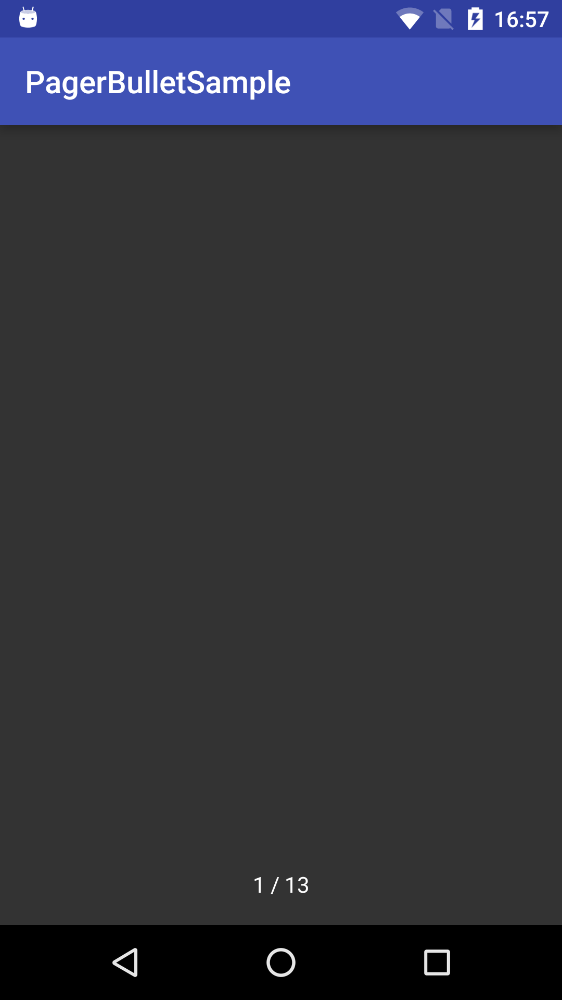
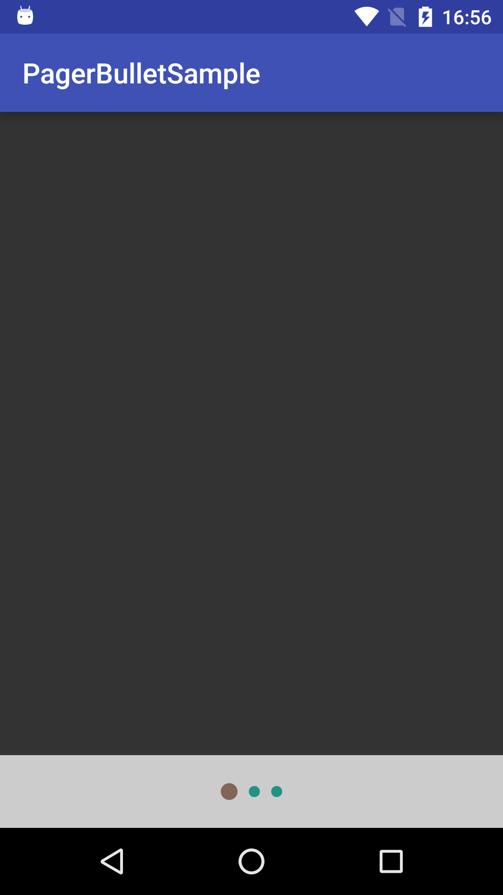

# PagerBullet
[](https://android-arsenal.com/details/1/3749)

<p>Android ViewPager with bottom dots</p>

<p>

</p>

# Quick start

1) Just add this dependency into your build.gradle
```gradle
compile 'com.robohorse.pagerbullet:pagerbullet:1.0.9'
```
2) Replace your default ViewPager by com.robohorse.pagerbullet.PagerBullet

3) Call this
```java
pagerBullet.invalidateBullets();
```
when 
```java
pagerAdapter.notifyDataSetChanged();
```
4) Profit!

# Customization
<b>Text indicator</b>

This library can show dots or text indicator, when ViewPager contains a lot of pages.
You can set limit of pages, when you want to show text indicator (default value is 20).

Just add
```java
pagerBullet.setTextSeparatorOffset(5);
```
and you will see text instead of dots, when pages more than 5:
<p>

</p>

You can customize this text by override
```xml
    <string name="pager_bullet_separator" formatted="false">%s / %s</string>
```
or color
```xml
    <color name="pager_bullet_text_indicator">#ffffff</color>
```

<b>Dot color:</b>
```xml
    <color name="pager_bullet_active">#836556</color>
    <color name="pager_bullet_inactive">#219382</color>
```
or
```java
pagerBullet.setIndicatorTintColorScheme(Color.WHITE, Color.BLUE);
```

<b>Dot size:</b>
```xml
    <dimen name="pager_bullet_indicator_active_dot_diameter">12dp</dimen>
    <dimen name="pager_bullet_indicator_inactive_dot_diameter">8dp</dimen>
```

<b>Dot margin:</b>
```xml
    <dimen name="pager_bullet_indicator_dot_margin">4dp</dimen>
```

<b>Dot container height:</b>
<p>

</p>

```xml
   <dimen name="pager_bullet_indicator_height">52dp</dimen>
```

or
```xml
   app:panelHeightInDp="52dp"
```
like this:
```xml
<?xml version="1.0" encoding="utf-8"?>
<FrameLayout xmlns:android="http://schemas.android.com/apk/res/android"
    xmlns:app="http://schemas.android.com/apk/res-auto"
    android:layout_width="match_parent"
    android:layout_height="match_parent">

    <com.robohorse.pagerbullet.PagerBullet
        android:id="@+id/pagerBullet"
        android:layout_width="match_parent"
        android:layout_height="match_parent"
        app:panelHeightInDp="52dp" />
    
</FrameLayout>
```

# About
Copyright 2016 Vadim Shchenev, and licensed under the MIT license. No attribution is necessary but it's very much appreciated. Star this project if you like it.
